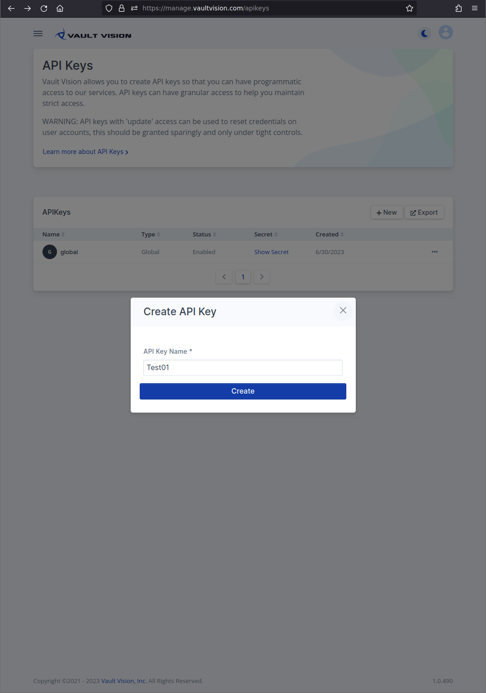

API Keys - [Vault Vision](https://vaultvision.com) 
========

API Keys grant access to [Vault Vision's](https://vaultvision.com) [API](api.md). You may create and manage API Keys in the [management console](https://manage.vaultvision.com/apikeys) and begin making requests to the public API at `https://api.vaultvision.com`.


## Overview

First remember that your API Keys are a __secret__ and must be kept secure, do not share your secret API keys in publicly accessible areas. To help identify them we give all API Keys a common prefix of `"vv_"`. Beyond that all characters are random, some examples of what your secret API Keys look like:

 - `vv_oFVTAiPkICpOewyuV2mINX1rSFxzdIkR`
 - `vv_uAmkBd4nRsjFPBfsJFrmvNmKOMARrapZ`

Once you have an API Key you are ready to begin using the API. For more information about how to use them see the [API Overview](api.md).


### Privileges

API Keys gain privileges by allowing `permissions` on `resources`. By default they apply globally to all resources within all current tenants and any tenants created in the future. However toggling the __Restricted__ button allows you to restrict access to only specific tenants instead.

The API has the following types of resources:

- All (matches all resources)
- Tenants
- Applications
- Metrics
- Users
- Credentials
- Identity Providers
- Email Providers	
- Signing Keys

Each resource may have one of the following permissions:

- None
- Read
- Write (Read / Write)


## Guide - Creating Global API Keys

This guide will walk you through creating your first secret API Key.

### Step 1 - Login to Management Console

Navigate to the management console at [management console](https://manage.vaultvision.com/apikeys). After logging in you will see a list of your current API Keys (if you have created any).


### Step 2 - Create API Key

Click the `+ New` button to open the `Create API Key` dialog. Once you selected a name for this key (used strictly for your own identification in the UI) click "Create".




### Step 3 - Review Settings

After creating your key you will be taken to the keys settings. Here you may select your key options for your new secret Global API Key. Below is an example of allowing `read` only access to all tenants.

```{note}
The privileges you grant __Global__ API Keys apply to all of your current tenants and any tenant you create in the future.
```


You may also grant global access to specific resources. For example to only allow access to __READ__ ALL current (and future) __Tenant Settings__, __READ__ only for your __User__ resources and __WRITE__ access to credentials you would do something like below:


### Step 4 - Restrict Privileges (OPTIONAL)

If you want to restrict access to one or more specific tenants you may toggle the __Restricted__ option. Now you may
assign the same resource specific access controls to specific tenants. For example to only allow access to __READ__ your sandbox (dev-xxxx prefixed) __Tenant Settings__ and __WRITE__ to your __User__ resources you would do something like below:


