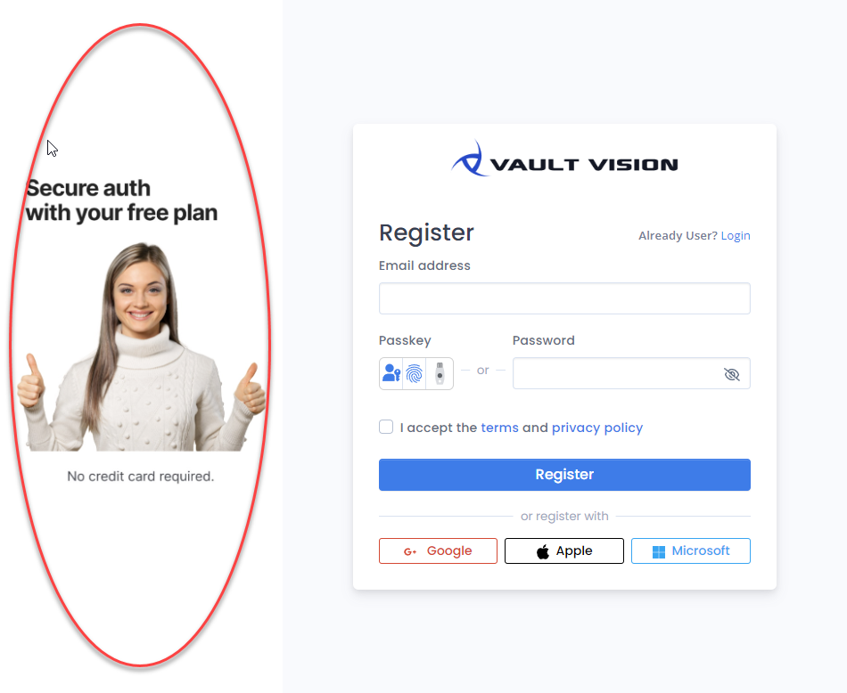

Custom Branding Designer - [Vault Vision](https://vaultvision.com) 
==================

## With our custom branding designer you will be able to set a custom image for your authentication pages

These are the available pages that you can customize
- Login
- Signup
- Forgot/Reset Password
- Verify Account (This is also the one used in the MFA/2FA verification flow)

### Custom Image Example
See the below image and the area highlighted in red, this is the image that can be customized

## Image requirements

The custom image should be:

- under 1MB
- .JPG or .PNG
- ideal dimension are 1080x1920, but the image is designed to scale to fit the area no matter what the browser viewport size is.

## Custom Branding Designer Management Page

Update the URL values in the [Vault Vision Management Panel](https://manage.vaultvision.com/go#branding) for your designer.
