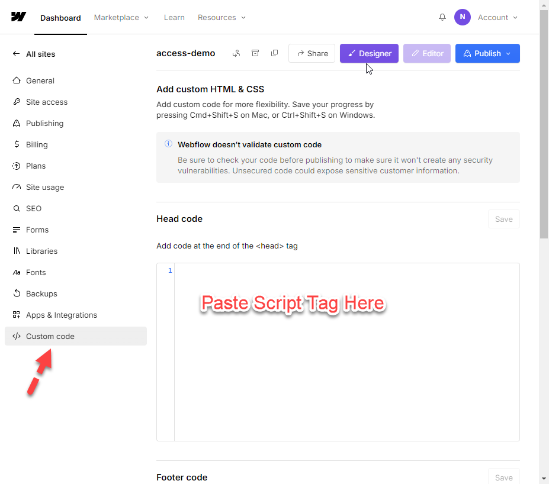

NoCode HTML and JS Toolkit - [Vault Vision](https://vaultvision.com) 
==================

## With our NoCode HTML and JS Toolkit you will be able to customize any static website, including sites on Webflow, Bubble, and Github Pages.

Our JS Toolkit has the following options that enable you to customize your login and signup flows.

#### Configuration Options 

- **VV_PRIVATE_LITE** - true/false: controls whether you want to use a lite version of the OIDC client in the Vault Vision Javascript SDK or if you want use the full version of the OIDC client in Vault Vision Javascript SDK.  The full version has all the OIDC actions performed natively in the browser's Javascript.  The lite version is designed to make use of a backend 'shim' that runs as a Javascript app hosted on a platform like Vercel.  This 'shim' can allow for the use of a private OIDC client that contains a secret.  This private 'shim' is useful when needed to embed access to a secret like an API key or Stripe key, or an access token.  Since this private 'shim' is run on a true backend platform, it can securely contain these secrets, secrets you don't want to expose in client/browser side Javascript.  Set to true to enable the lite client, and use a 'shim'.  Set to false to use the full client and have all OIDC actions executed client side in the browser.  Default is false.  

- **VV_BASE_URL** - URL string: If using a 'shim' and the lite OIDC client, set this to the root URL of your shim. Ex. https://myshimsite.com  If using the full OIDC client, this should be set to the root URL of your website. Ex. https://mysmainwebsite.net  

- **VV_USER_SIGN_UP_PATHNAME** - pathname string: this is the path name where users will be sent to after a successful sign up. Ex. "/welcome"  

- **VV_USER_SIGN_IN_PATHNAME** - pathname string: this is the path name where users will be sent to after a successful sign in. Ex. "/user-dashboard"  

- **VV_USER_SIGN_OUT_PATHNAME** - pathname string: this is the path name where users will be sent to after a successful logout. Ex. "/session-over"  

- **VV_REQUIRE_USER** - true/false: controls whether all pages require an authenticated user. If you want every page to require a logged in user and redirect non-logged in users to the login page, set this to true.  Default is false.  

- **VV_USER_SIGN_IN_CALLBACK** - an actual javascript function: The any local javascript function you want called after a successful sign in or sign up. It must be a real function and not just the string of a function name. Ex. "post_login"  

- **VV_USER_SIGN_OUT_CALLBACK** - an actual javascript function: The any local javascript function you want called after a successful loggout. It must be a real function and not just the string of a function name. Ex. "post_logout"  

- **VV_AUTH_REQUIRED_PAGES** - regex string OR array of string pathnames: these are the pages that will require users to be authenticated. If a user visits a page whose pathname matches the regex or whose pathname is in the array, then that user will be redirect to login if they have not yet logged in.  If the user is logged in, they will be able to visit and see the page. Ex. "/internal", "required", ["/page1", "/page2", "/page3"]  

- **VV_ALLOWED_PATHS_REGEX_PER_USER** - an actual javascript object {email:path_regex,email:path_regex,...}: This is the object where users can strictly be allowed to access certain pages.  The allowlist can be customized per user, and it's value is a regex string that is used to match against the pathname of the page visited.  If the regex does match then the user with that email will be allow to see and visit the page, otherwise if it does not match they will be redirected to the access_denied page. Ex. {"mike_any_page_with_order@domain.com":"orders", "sally_all_pages@domain.com":".\*", "john_exact_page@domain.com":"^/exactlythis.html$" }

- **VV_ACCESS_DENIED_PAGEPATH** - pathname string: this is the path name where users will be sent if they are listed in the VV_ALLOWED_PATHS_REGEX_PER_USER setting and the current pathname of the page they visited does not match the allow page regex for their user. Ex. "/denied.html"  

- **VV_PLAN_LABEL** - label string: this is the label used to specify the name of the property in the user.profile.metadata for the user's subscription plan. Ex. "access_plan"  Default is "vv_plan".

- **VV_ALLOWED_PATHS_REGEX_PER_METADATAPLAN** - an actual javascript object {planA:path_regex,planB:path_regex,...}: This is the object where users can strictly be allowed access to certain pages based on the plan stored in their userinfo or Stripe metadata.  The allowlist can be customized per metadata property, and it's value is a regex string that is used to match against the pathname of the page visited.  If the regex does match then the user with that metadata plan will be allow to see and visit the page, otherwise if it does not match they will be redirected to the access_denied page. Ex. {"planA":"/planA/\*", "planAll":".\*", "planB":"^/exactlythisplanBpage.html$" }<br><br>In order to use the Metadata plan access control, you must include a 'metadata' properity in your userinfo payload.  The userinfo payload should look something like: 
```javscript 
    user: {
        profile: {
          "sub":"e6MQTjUoo8u7",
          "auth_time":1732628416,
          "email":"mike@domain.com",
          "expires_at":1732632043,
          "metadata":{"vv_plan":"planA"}
	    }
  	}
```

## How to install the configuration options

To install or make use of these options you simply need to insert a &lt;script&gt; tag into your pages.  The script tag should look something like:

```html
<script>
window.vv_process = window.vv_process || {env: {}};  //KEEP EXACTLY AS-IS
window.vv_process.env = window.vv_process.env || {}; //KEEP EXACTLY AS-IS
window.vv_process.env.VV_USER_SIGN_UP_PATHNAME="/faq/welcome-message";  //MODIFY AT WILL
window.vv_process.env.VV_USER_SIGN_IN_PATHNAME="/faq/special-welcome-message-after-you-have-logged-in"; //MODIFY AT WILL
window.vv_process.env.VV_USER_SIGN_OUT_PATHNAME="/faq/your-feedback-is-greatly-appreciated";  //MODIFY AT WILL
window.vv_process.env.VV_REQUIRE_USER=false;  //MODIFY AT WILL
window.vv_process.env.VV_USER_SIGN_IN_CALLBACK=function(){alert("sign_in"); }  //MODIFY AT WILL
window.vv_process.env.VV_USER_SIGN_OUT_CALLBACK=function(){alert("sign_out"); }  //MODIFY AT WILL
window.vv_process.env.VV_AUTH_REQUIRED_PAGES="/internal";  //MODIFY AT WILL
window.vv_process.env.VV_ALLOWED_PATHS_REGEX_PER_USER={"mike_any_page_with_order@domain.com":"orders", "sally_all_pages@domain.com":".*", "john_exact_page@domain.com":"^/exactlythis.html$" } //MODIFY AT WILL
window.vv_process.env.VV_ACCESS_DENIED_PAGEPATH="/denied.html";  //MODIFY AT WILL
</script>
```

It is very important to keep the first 2 lines of the script tag exactly as-is, if these are modified then any built-in environment variables might be over-written.  For the other lines you can remove or modify as you see fit in order to make the most of our JS Toolkit configuration parameters.

## Webflow install

For Webflow you can insert the above &lt;script&gt; tag into the 'Custom code' feature in 'Settings' for your Webflow site, see image below.

