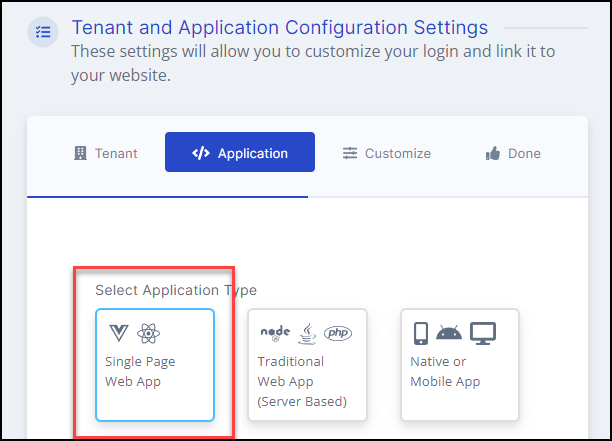

Vault Vision - User Authentication Platform - Quick Setup
==================
This setup will get you up and running with a local web application where you can experiment with all the flow and integration points.

```{note}
Prefer to watch a video?

[React application user authentication setup](https://www.youtube.com/watch?v=K7It1YuXyBc)

```

## Create an Account at Vault Vision

Navigate to [Register](https://manage.vaultvision.com/register) and create an account.


## Use the getting started wizard and create a tenant with a default application

Navigate to [Getting Started](https://manage.vaultvision.com/start) and create a tenant and application.

First you will need to choose a name for the url for your login and registration pages. Pick a name for your tenant address, use our vvkey.io address or a custom domain with our Professional Plan (Free 30 day trial).

You can accept all the defaults, although you will need to give your tenant and application a name.  The name can be anything, it's only purpose is to help you distingish it later when you have multiple tenants and applications.

```{note}
For these default local applications make sure you select 'Single Page Web App' as the Application Type.



```


## Option 1 create a React Application with our React js boilerplate

- clone this github repo containing our React js boilerplate project <https://github.com/vaultvision/react-boilerplate-vv>

- Copy over the env vars from the [Vault Vision Management Panel](https://manage.vaultvision.com/go#applications) into a NEW .env file located at the root of the project.  You can copy this file as an example <https://github.com/vaultvision/react-boilerplate-vv/blob/master/.env-example> , or simply rename it .env and populate it with your correct env vars.

- Run the npm start command to launch a local instance
```
npm run start
```

## Option 2 create an application using our HTML boilerplate

- clone this github repo containing our HTML boilerplate project <https://github.com/vaultvision/html-boilerplate>

- Copy over the env vars from the [Vault Vision Management Panel](https://manage.vaultvision.com/go#applications) into one of these files: <https://github.com/vaultvision/html-boilerplate/blob/main/src/scripts-init/oidcAppRouter.js> or <https://github.com/vaultvision/html-boilerplate/blob/main/src/scripts-init/oidcbinding.js>

- Run the npm start command to launch a local instance
```
npm run start
```
