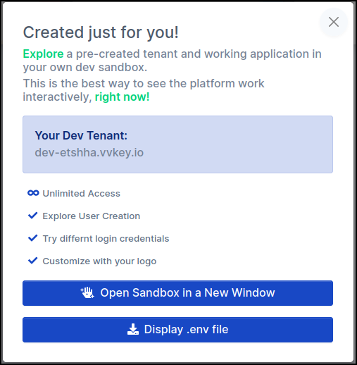
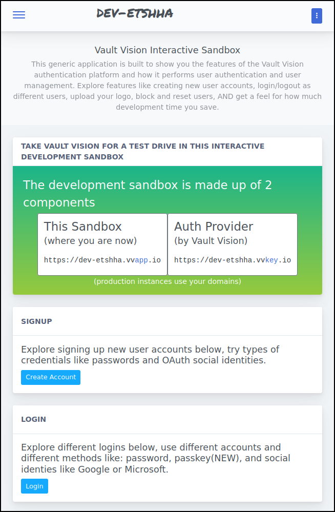
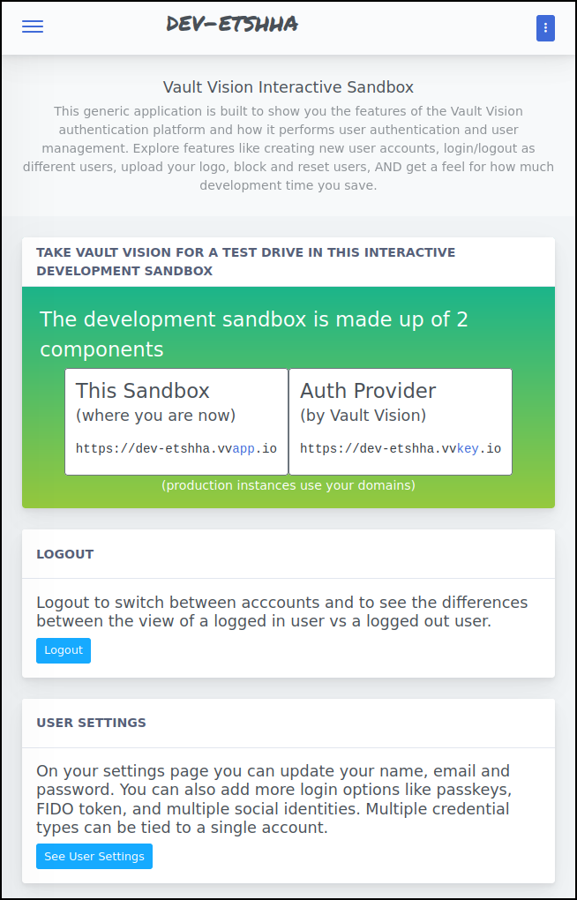
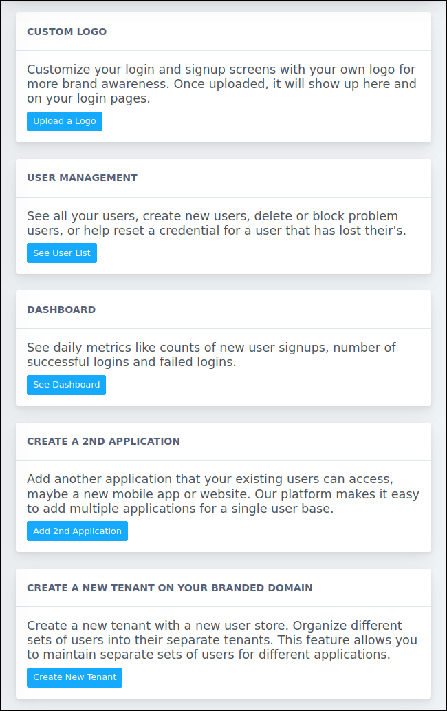
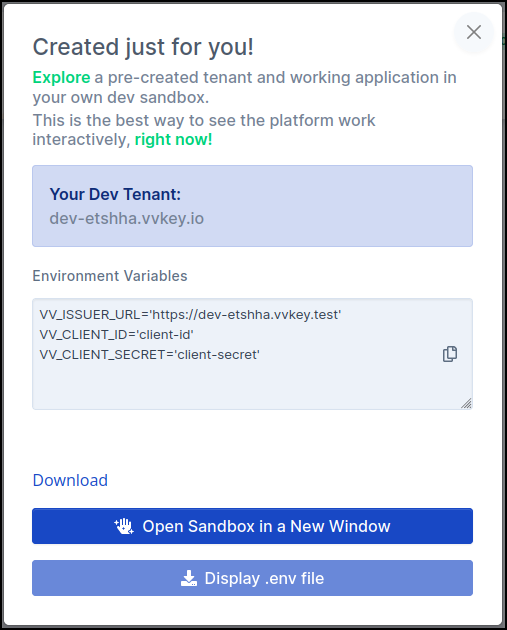

Quick Start
==================

This setup will get you up and running in less than a minute.


## Create an Account at Vault Vision

Navigate to [Register](https://manage.vaultvision.com/register) and create an account.


## Try out your development sandbox

Each Vault Vision account is provisioned a development sandbox [Tenant](/tenants.md) during registration. You will see the image below right after you signup or you can access it again by just visiting the [Management Panel](https://manage.vaultvision.com):




Click the "**Open Sandbox in a New Window**" button to load the example application running on our servers:



Click signup to create your first [User](/users.md). You can then test logging out or updating your settings:




Feel free to explore the other options in the sandbox before moving on:




## Run your own example application locally

We provide example applications written in Node, Go and Python with more to come.

```{note}
Our system is built on open protocols that support every programming language. [Get in touch](https://vaultvision.com/contact-us/) with us if you would like support integrating with a programming language we don't currently provide an example for.
```

### Get your configuration values

Access the development sandbox popin again by visiting the [Management Panel](https://manage.vaultvision.com) and click the "**Display .env file**" button to get your configuration values for our open source example projects. Download or copy it locally into a file named `.env`, we will use it in the examples we configure next:




### Run the [Go auth example](https://github.com/vaultvision/go-auth-example)

Get the source code from the [go-auth-example](https://github.com/vaultvision/go-auth-example) repository:
```bash
git clone https://github.com/vaultvision/go-auth-example
cd go-auth-example
```

Configure the app by placing the `.env` file we obtained previously into the root of the repo folder:
```
vi .env
```

Run the example on localhost:
```bash
go run main.go
```

Visit [http://localhost:8090](http://localhost:8090) in your browser.


### Run the [Node auth example](https://github.com/vaultvision/node-auth-example)

Get the source code from the [node-auth-example](https://github.com/vaultvision/node-auth-example) repository:
```bash
git clone https://github.com/vaultvision/node-auth-example
cd node-auth-example
```

Configure the app by placing the `.env` file we obtained previously into the root of the repo folder:
```
vi .env
```

Install dependencies:
```bash
npm install
```

Run the example on localhost:
```bash
npm run dev
```

Visit [http://localhost:8090](http://localhost:8090) in your browser.


### Run the [Python auth example](https://github.com/vaultvision/python-auth-example)

Get the source code from the [python-auth-example](https://github.com/vaultvision/python-auth-example) repository:
```bash
git clone https://github.com/vaultvision/python-auth-example
cd python-auth-example
```

Configure the app by placing the `.env` file we obtained previously into the root of the repo folder:
```
vi .env
```

Install dependencies:
```bash
python -m venv .venv  # Or python3 for some systems
.venv/bin/pip install --upgrade pip
.venv/bin/pip install -r requirements.txt
```

Run the example on localhost:
```bash
.venv/bin/python app.py
```

Visit [http://localhost:8090](http://localhost:8090) in your browser.


## Testing your local example

With your local example running you can now see how you can use the same credentials to login to multiple applications hosted on different domains written in entirely different programming languages. Feel free to explore multiple programming languages using the same .env file.
